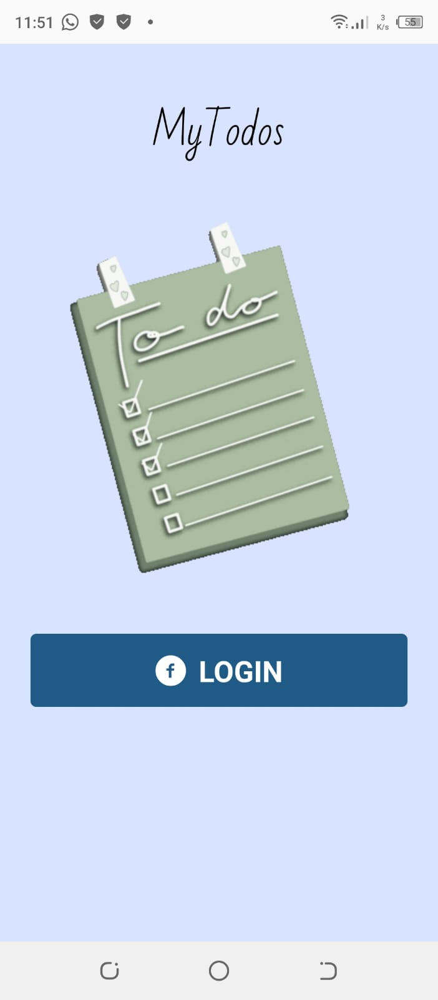
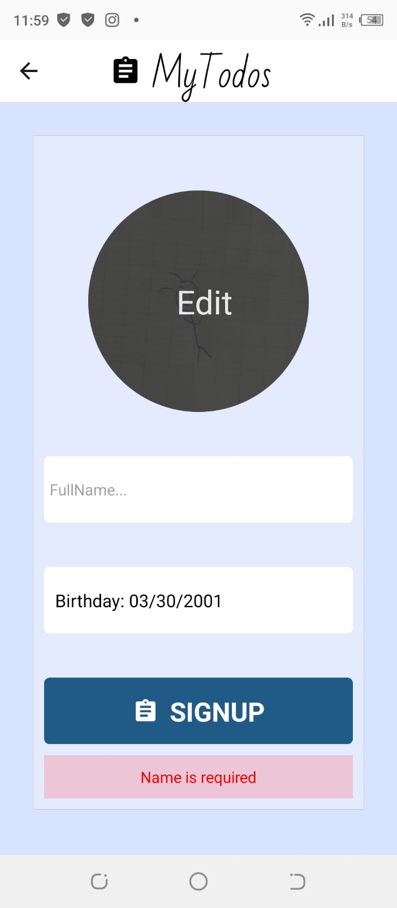
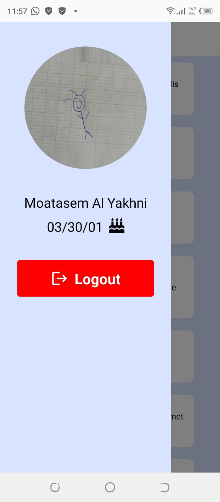
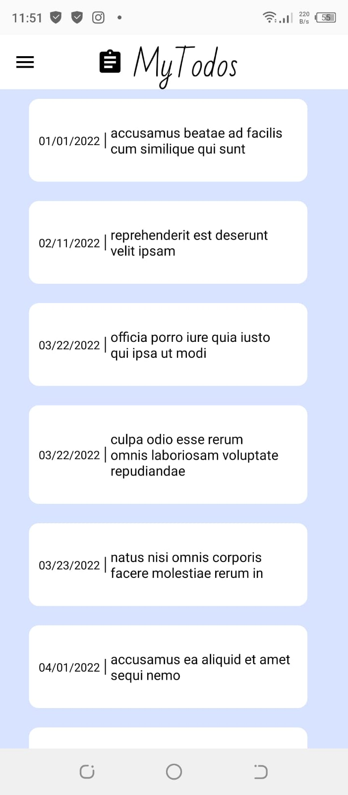

# MyTodos: React Native

>## Introduction
<br>

MyTodos logs user using [facebook login api](https://developers.facebook.com/docs/facebook-login/). It allows the user to view pre-assigned todo list.
<br><br>
**:loudspeaker: Note**
<br>

MyTodos has no backend, it uses a [fake api](https://my-json-server.typicode.com/moatasemyakhni/mockjson/db) generated using [mockend](https://mockend.com/).
<br><br>

<details>
<summary>Screenshots</summary>

| Login | Signup | Setting |
|------|-----------| --------|
|     | | |

|  Todo   | Details    |
|---------|------------|
|     |        |
  
</details>
<br><br>

>## Prerequisites

* npm
  ```sh
  npm install npm@latest -g
  ```
* expo CLI
   ```sh
   npm install -g expo-cli
   ```
* eas builder
    ```sh
    npm install -g eas-cli
    ```

>## Installation
1. clone repo
    ```sh
    git clone https://github.com/moatasemyakhni/todo-react-native.git
    ```
2. npm install
    ```sh
    npm install
    ```
